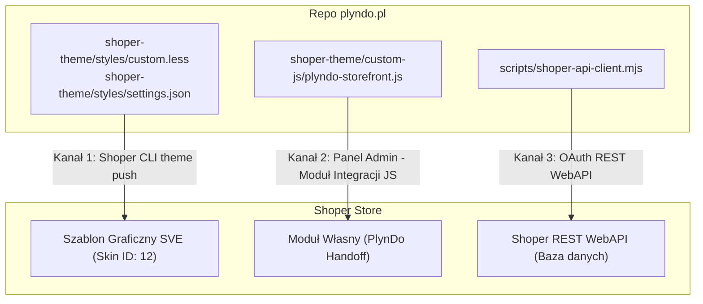

# Shoper Deployment Channels & Architecture

Dokument określa architekturę wdrożeniową dla sklepu Shoper Premium (`sklep562393.shoparena.pl` / `sklep.plyndo.pl`) oraz landing page `plyndo.pl`.

---

## 1. Architektura Trzech Kanałów Wdrożenia

W ekosystemie Shoper Premium modyfikacje sklepu odbywają się przez 3 dedykowane, niezależne kanały:



---

## 2. Szczegóły Kanałów

### Kanał 1: Shoper CLI (`@shoper/cli`) — Szablon Graficzny SVE
- **Zakres:** Style LESS (`styles/custom.less`), konfiguracja tokenów graficznych (`styles/settings.json`), ustawienia układu (`settings/details.json`, `settings/settings.json`).
- **Autoryzacja:** Token developerski zapisany w `~/.shoper/credentials.json` (klucz `PlyndoCLI`, ważny do 12.08.2027).
- **Procedura pushu:**
  ```bash
  cd shoper-theme
  npx @shoper/cli theme push
  ```
- **Zasady:**
  - Tokeny SVE: ciemny motyw (`primaryColor: #1a1918`, `secondaryColor: #5c77b7`, `btnBorderRadius: 9999`).
  - Switzer i Lora są importowane w `custom.less` z zachowaniem fallbacku do fontów systemowych.

---

### Kanał 2: Moduł Własny JS — Skrypt Storefrontu (Storefront API)
- **Zakres:** `shoper-theme/custom-js/plyndo-storefront.js`.
- **Dlaczego manualnie:** Shoper CLI domyślnie wyklucza pliki JS z paczki motywu (brak wpisów w `filesStructure.json`). Bezpiecznym i trwałym kanałem wdrożenia logiki klienckiej jest moduł własny w panelu.
- **Ścieżka w panelu:**
  *Wygląd i treści → Wygląd sklepu → Obecny szablon graficzny → Moduły → Dodaj moduł własny*
  - **Nazwa:** `PlynDo Handoff`
  - **Typ:** Moduł integracji / Skrypt JS
  - **Pozycja:** Stopka strony / Przed zamknięciem `</body>`
  - **Zawartość:** Kod z `shoper-theme/custom-js/plyndo-storefront.js`
- **Odpowiedzialność skryptu:**
  1. Odbiór parametrów handoffu (`?add=...&promo=...`) z landing page i synchroniczne napełnienie koszyka.
  2. Debounce zdarzeń `basket.updated` (150ms) zapobiegający pętlom zapytań.
  3. Twarda blokada checkoutu (`applyCheckoutGuard`): blokowanie przycisku przejścia do kasy, gdy liczba sztuk $\notin \{4, 8, 12\}$ z dynamicznym komunikatem o brakujących sztukach.
  4. Ukrywanie zbędnych elementów (pole na kody rabatowe, boksy demo).

---

### Kanał 3: Shoper REST WebAPI — Katalog, Stany, Kupony
- **Zakres:** Zarządzanie produktami, kategoriami, magazynem i kodami rabatowymi.
- **Autoryzacja:** OAuth Bearer Token generowany przez klienta API (`scripts/shoper-api-client.mjs`).
- **Wymagane kupony rabatowe:**
  | Kod kuponu | Rabat | Zastosowanie |
  |---|---|---|
  | `PLYNDO-PACK-4` | **20%** | Automatyczny rabat dla paczki 4 szt. |
  | `PLYNDO-PACK-8` | **30%** | Automatyczny rabat dla paczki 8 szt. |
  | `PLYNDO-PACK-12` | **40%** | Automatyczny rabat dla paczki 12 szt. |

---

## 3. Podział Ról Między Stronami

| Funkcja | Landing Page (`plyndo.pl`) | Sklep Shoper (`sklep.plyndo.pl`) |
|---|---|---|
| Prezentacja oferty i storytelling | **Tak** (główne źródło) | Nie (uproszczony widok) |
| Konfigurator paczek (4, 8, 12) | **Tak** (kreator koszyka) | Nie (tylko weryfikacja) |
| Kalkulacja rabatu i oszczędności | **Tak** (UI feedback) | **Tak** (silnik kuponowy) |
| Checkout, płatności, wysyłka | Nie (handoff do sklepu) | **Tak** (Lean Checkout) |
| Walidacja minimalnej paczki | **Tak** (zablokowany CTA) | **Tak** (blokada kasy) |

---

## 4. Narzędzia Operacyjne i Skrypty Automatyzacji (`scripts/`)

Wszystkie skrypty pomocnicze pobierają dane uwierzytelniające wyłącznie ze zmiennych środowiskowych (`.env.local`) lub interaktywnej sesji przeglądarki. Żadne hasła ani tokeny nie są zapisywane w kodzie.

| Skrypt | Cel i Opis | Wymagania | Sposób uruchomienia |
|---|---|---|---|
| `scripts/chrome-admin-orchestrator.mjs` | Orkiestracja zadań administracyjnych Shoper przez aktywną kartę Google Chrome | macOS, Chrome | `node scripts/chrome-admin-orchestrator.mjs` |
| `scripts/create_custom_module_shoper.mjs` | Utworzenie modułu własnego przez XHR w szablonie SVE (ID 12) | macOS, Chrome | `node scripts/create_custom_module_shoper.mjs` |
| `scripts/fill_module_form.mjs` | Wypełnienie formularza modułu integracyjnego w panelu | macOS, Chrome | `node scripts/fill_module_form.mjs` |
| `scripts/fix_all_coupons.mjs` | Weryfikacja i konfiguracja kuponów rabatowych PLYNDO-PACK-4/8/12 | macOS, Chrome | `node scripts/fix_all_coupons.mjs` |
| `scripts/inject_custom_js_chrome.mjs` | Wstrzyknięcie skryptu storefront JS do sekcji nagłówka/stopki | macOS, Chrome | `node scripts/inject_custom_js_chrome.mjs` |
| `scripts/paste_module_js.mjs` | Kopiowanie i wklejanie kodu do edytora CodeMirror w panelu Shopera | macOS, pbcopy, Chrome | `node scripts/paste_module_js.mjs` |
| `scripts/save_myintegrations.mjs` | Zapisanie skryptu storefrontu w `/admin/myintegrations` | macOS, pbcopy, Chrome | `node scripts/save_myintegrations.mjs` |
| `scripts/shoper-full-admin-tasks.mjs` | Wykonanie zestawu zadań administracyjnych przez Playwright | Node.js, Playwright | `node scripts/shoper-full-admin-tasks.mjs` |
| `scripts/shoper-live-daemon.mjs` | Monitorowanie i asysta w sesji panelu Shoper w trybie live z 2FA | Node.js, Playwright | `node scripts/shoper-live-daemon.mjs` |
| `scripts/shoper-live-login.mjs` | Interaktywne logowanie z obsługą 2FA/SMS i zapisem ciasteczek | Node.js, Playwright | `node scripts/shoper-live-login.mjs` |
| `scripts/shoper-session-manager.mjs` | Pomocnik zarządzania sesją przeglądarki i ponownego użycia ciasteczek | Node.js, Playwright | Moduł importowany |
| `scripts/shoper-api-client.mjs` | Klient REST WebAPI Shoper (OAuth Bearer) do zarządzania danymi | Node.js, .env.local | `node scripts/shoper-api-client.mjs` |
| `scripts/verify_production_truth.mjs` | Pakiet testów weryfikacji produkcyjnej prawdy (T1–T11) | Node.js, Playwright | `node scripts/verify_production_truth.mjs` |

