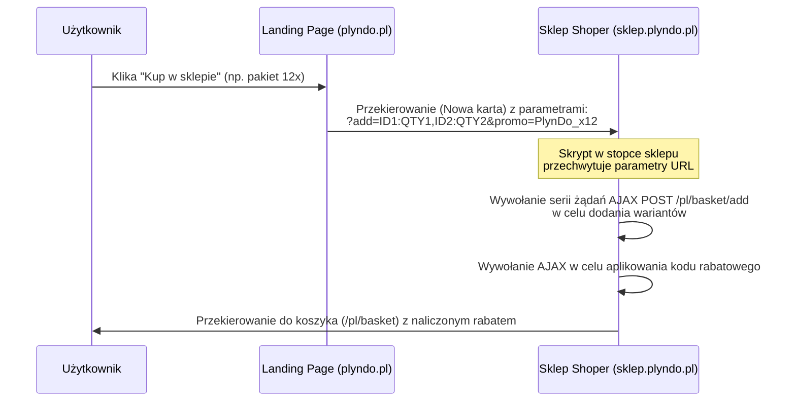

# Przewodnik Integracji Landing Page z Shoper (sklep.plyndo.pl)

Niniejszy dokument przedstawia wytyczne i gotowy kod integracyjny, który należy wdrożyć w panelu administracyjnym Shoper (`sklep.plyndo.pl`), aby automatycznie obsługiwać koszyki i rabaty przesyłane z landing page `plyndo.pl`.

---

## 1. Architektura Integracji

Ponieważ landing page (`plyndo.pl`) oraz sklep (`sklep.plyndo.pl`) znajdują się na różnych domenach, bezpośrednie żądania AJAX (CORS) napotykają na blokady ciasteczek sesyjnych (SameSite).

### Przepływ Handoff (Przekazanie Koszyka)



---

## 2. Konfiguracja po stronie Shoper (Panel Administratora)

### Krok 1: Wprowadzenie ID Wariantów (Stock ID)
Upewnij się, że identyfikatory wariantów w Shoperze odpowiadają wartościom `shoperStockId` w pliku [products.js](file:///Users/mk/Dev_Env/Plyn_DO/plyndo.pl/src/data/products.js) dla każdego z 12 płynów.
*Np. wariancie 1-litrowym dla Płynu do naczyń musi mieć ID wariantu (stock ID) = `182`.*

### Krok 2: Konfiguracja Kuponów Rabatowych
W panelu Shoper przejdź do: **Zwiększaj sprzedaż -> Kupony rabatowe** i stwórz 3 kupony:

1. **Kod kuponu:** `PlynDo_x4`
   - **Rabat:** Procentowy `20%`
   - **Warunki:** Zastosowanie do całego koszyka. Minimalna liczba produktów w koszyku = 4.
2. **Kod kuponu:** `PlynDo_x8`
   - **Rabat:** Procentowy `30%`
   - **Warunki:** Zastosowanie do całego koszyka. Minimalna liczba produktów w koszyku = 8.
3. **Kod kuponu:** `PlynDo_x12`
   - **Rabat:** Procentowy `40%`
   - **Warunki:** Zastosowanie do całego koszyka. Minimalna liczba produktów w koszyku = 12.

---

## 3. Kod Iniekcji JS stopki Shoper (Custom Integration Script)

Wklej poniższy skrypt w panelu Shoper: **Dodatki i integracje -> Integracje własne -> Nagłówek i Stopka (Sekcja Stopka / Footer)** lub skonfiguruj go jako tag HTML w Google Tag Managerze (GTM) podpiętym pod sklep.

```javascript
<script>
(function() {
    // 1. Sprawdzenie obecności parametrów w adresie URL
    const urlParams = new URLSearchParams(window.location.search);
    const addParam = urlParams.get('add'); // np. "182:3,184:1"
    const promoParam = urlParams.get('promo'); // np. "PlynDo_x4"

    if (!addParam) {
        return; // Brak koszyka do wdrożenia
    }

    // Wyświetlenie nakładki ładowania (opcjonalne, podnosi UX)
    const overlay = document.createElement('div');
    overlay.style.position = 'fixed';
    overlay.style.top = '0';
    overlay.style.left = '0';
    overlay.style.width = '100%';
    overlay.style.height = '100%';
    overlay.style.backgroundColor = 'rgba(255, 255, 255, 0.9)';
    overlay.style.zIndex = '99999';
    overlay.style.display = 'flex';
    overlay.style.flexDirection = 'column';
    overlay.style.alignItems = 'center';
    overlay.style.justifyContent = 'center';
    overlay.style.fontFamily = 'sans-serif';
    overlay.innerHTML = '<div style="font-size:18px;font-weight:bold;margin-bottom:10px;">Trwa przygotowywanie Twojego pakietu...</div><div style="font-size:14px;color:#666;">Zaraz zostaniesz przekierowany do koszyka</div>';
    document.body.appendChild(overlay);

    // 2. Parsowanie listy produktów
    // Format: stockId:qty,stockId:qty
    const items = addParam.split(',').map(itemStr => {
        const parts = itemStr.split(':');
        return {
            stockId: parseInt(parts[0], 10),
            quantity: parts[1] ? parseInt(parts[1], 10) : 1
        };
    }).filter(item => !isNaN(item.stockId));

    if (items.length === 0) {
        if (overlay) overlay.remove();
        return;
    }

    // 3. Sekwencyjne dodawanie produktów do koszyka Shoper za pomocą AJAX
    // Shoper przyjmuje POST na adres: /pl/basket/add
    // Dane: { "basket-add": stockId, "quantity": quantity }
    
    let currentIndex = 0;

    function addNextItem() {
        if (currentIndex >= items.length) {
            // Wszystkie produkty zostały dodane, teraz aplikujemy kupon
            applyPromoCode();
            return;
        }

        const currentItem = items[currentIndex];

        // Wywołanie natywnego kontrolera Shoper
        const xhr = new XMLHttpRequest();
        xhr.open('POST', '/pl/basket/add', true);
        xhr.setRequestHeader('Content-Type', 'application/x-www-form-urlencoded; charset=UTF-8');
        xhr.setRequestHeader('X-Requested-With', 'XMLHttpRequest');

        xhr.onload = function() {
            currentIndex++;
            // Małe opóźnienie chroniące przed race-condition w sesji bazy Shoper
            setTimeout(addNextItem, 150);
        };

        xhr.onerror = function() {
            // W razie błędu przechodzimy dalej, by nie blokować procesu
            currentIndex++;
            setTimeout(addNextItem, 150);
        };

        const params = 'basket-add=' + currentItem.stockId + '&quantity=' + currentItem.quantity;
        xhr.send(params);
    }

    // 4. Aplikowanie kodu rabatowego
    // Shoper przyjmuje kody promocyjne poprzez wysłanie formularza na podstronie koszyka /pl/basket
    // z polem "code" w formularzu
    function applyPromoCode() {
        if (!promoParam) {
            redirectToBasket();
            return;
        }

        const xhr = new XMLHttpRequest();
        xhr.open('POST', '/pl/basket', true);
        xhr.setRequestHeader('Content-Type', 'application/x-www-form-urlencoded; charset=UTF-8');
        xhr.setRequestHeader('X-Requested-With', 'XMLHttpRequest');

        xhr.onload = function() {
            redirectToBasket();
        };

        xhr.onerror = function() {
            redirectToBasket();
        };

        // Parametry formularza dodawania kodu rabatowego w Shoperze
        const params = 'code=' + encodeURIComponent(promoParam);
        xhr.send(params);
    }

    // 5. Finalne przekierowanie do koszyka
    function redirectToBasket() {
        // Usuwamy parametry z adresu URL, by ponowne odświeżenie koszyka nie dublowało produktów
        window.location.href = '/pl/basket';
    }

    // Rozpoczęcie procesu
    // Upewniamy się, że strona została załadowana i pliki cookie sesji są dostępne
    if (document.readyState === 'complete' || document.readyState === 'interactive') {
        addNextItem();
    } else {
        window.addEventListener('DOMContentLoaded', addNextItem);
    }
})();
</script>
```

---

## 4. Testy Integracyjne (Uruchomienie Krok po Kroku)

1. **Wyczyszczenie ciasteczek sklepu:** Wejdź na `sklep.plyndo.pl` i wyczyść koszyk oraz pliki cookie.
2. **Symulacja przejścia z LP:** Otwórz nową kartę i wklej adres URL z przykładowym koszykiem:
   `https://sklep.plyndo.pl/?add=182:10,183:2&promo=PlynDo_x12`
3. **Weryfikacja automatyzacji:** Skrypt iniekcyjny powinien przechwycić ruch, wyświetlić nakładkę ładowania i przekierować Cię na stronę `/pl/basket`.
4. **Koszyk wynikowy:** W koszyku powinieneś zobaczyć:
   - 10 sztuk Płynu do naczyń (ID: `182`)
   - 2 sztuki Płynu do zmywarki (ID: `183`)
   - Łącznie 12 butelek.
   - Zaaplikowany automatycznie kod kuponu `PlynDo_x12` naliczający rabat `40%` na całe zamówienie.
